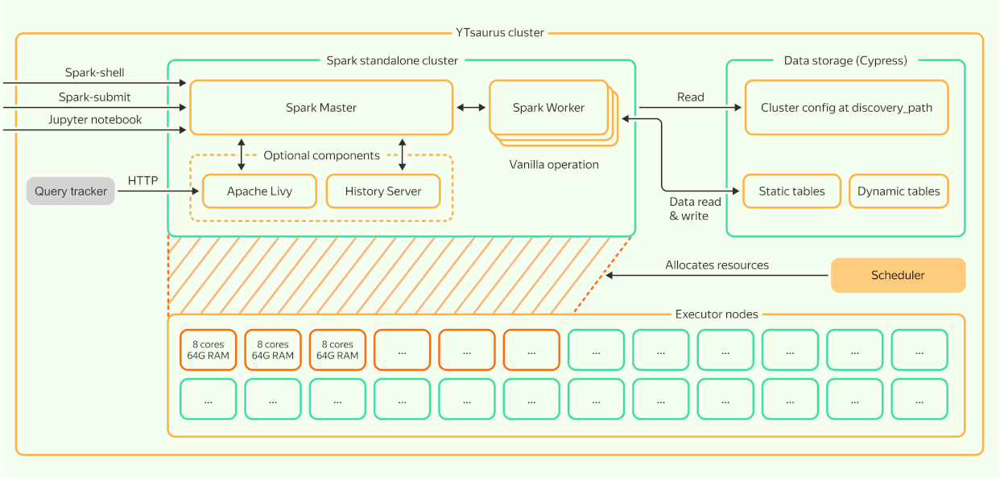

# Описание кластера SPYT

В данном разделе приводится верхнеуровневое описание кластера SPYT, его компонент и структуры приложения на Spark.

Запуск кластера описан в отдельном [разделе](../../../../../user-guide/data-processing/spyt/cluster/cluster-start.md).

## Spark-приложение { #spark-app }

Spark-приложение состоит из *драйвера* (driver) и *экзекьюторов* (executor).

1. Драйвер выполняет основной код, планирует SQL-запросы и разбивает их на *таски*, которые можно выполнять параллельно.
2. Драйвер не выполняет таски сам, а "поручает" эту работу экзекьюторам. Драйвер направляет запрос на создание экзекьюторов планировщику (scheduler).
3. Планировщик выделяет на узлах кластера контейнеры необходимого размера и запускает в них экзекьюторы.
4. Экзекьюторы создаются в кластере и обмениваются сообщениями с драйвером по сети.

{ .center }

При запуске приложения необходимо указать характеристики экзекьюторов (ядра и память) и ограничение на число экзекьюторов.

По умолчанию во всех клиентах SPYT указаны экзекьюторы с 4 ядрами и 16 ГБ памяти (4 ГБ на ядро). Данная настройка должна подходить для большинства задач.



Экзекьютор может выполнять несколько подзадач одновременно. Как правило число подзадач, которое может выполнять экзекьютор, равно числу его ядер.



### Число ядер в экзекьюторе { #number-cores }

Spark не может изменять характеристики экзекьютора "на лету", но может работать с меньшим числом экзекьюторов, чем изначально предполагалось.
Экзекьютор – это один процесс, одна JVM. Если в кластере нет воркеров со свободными 16 ГБ памяти, экзекьютор не будет создан, даже если в кластере доступен меньший объем памяти. Необходимо, чтобы было свободно 16 ГБ памяти единоразово.

На каждое ядро экзекьтора в его JVM создается отдельный тред, который будет выполнять задачи. Со всеми вытекающими последствиями мультитредовости: чем больше тредов, тем больше накладные расходы.

Экзекьюторы с одним ядром невыгодны из-за расходов на общение экзекьюторов между собой, на широковещательные сообщения, на объекты-синглтоны, которые треды-исполнители могут переиспользовать между собой. Например, чтобы сделать map-side join, копия маленькой таблицы присоединяется к каждому экзекьютору. В случае одного экзекьютора с 4-мя ядрами потребуется хранить одну копию таблицы. В случае четырёх экзекьюторов по одному ядру потребуется четыре копии таблицы и как следствие больше памяти.

Более подробное описание содержится в [документации Spark](https://spark.apache.org/docs/latest/cluster-overview.html).

## Spark Standalone в {{product-name}} { #spark-standalone }

Чтобы получить экзекьюторы, драйвер делает запрос *планировщику* (scheduler) ресурсов.

Для создания контейнеров нужного размера необходимо знать, какие узлы кластера существуют и сколько в них ресурсов. Обычно функции создания контейнеров выполняет [YARN](https://hadoop.apache.org/docs/current/hadoop-yarn/hadoop-yarn-site/YARN.html) или [Mesos](https://mesos.apache.org/), в системе {{product-name}} существует свой планировщик ресурсов.

В текущей реализации есть два варианта запуска Spark задач: [с использованием планировщика {{product-name}}](../../../../../user-guide/data-processing/spyt/launch.md#submit), либо с использованием внутреннего Spark Standalone кластера, который разворачивается внутри Vanilla операции.

Spark Standalone состоит из *мастера* и *воркеров*. Каждый воркер знает, сколько ресурсов можно занять на узле кластера где запущен воркер, и умеет предоставлять ресурсы по запросу. Мастер координирует работу: он получает запросы от драйвера и решает, на каких воркерах создать экзекьюторы.

{ .center }

Для запроса ресурса у мастера драйверу необходимо знать хост и порт мастера. При запуске в Vanilla-операции Spark-мастер попадает на случайный узел кластера {{product-name}} и открывает там порт в диапазоне от 27000 до 27200. После этого Spark-мастер прописывает свой хост и порт в Кипарисе в специальную директорию `discovery-path`. В драйвере существует код, который обращается к Кипарису, узнаёт хост и порт Spark-мастера и обращается к нему.

{ .center }

Кластер планировщика запускается командой `spark-launch-yt`. В аргументах команды необходимо указать:
- сколько ресурсов будет у каждого воркера (ядра / память);
- число воркеров;
- какую директорию Кипариса использовать как `discovery-path`.



Разница между приложением и кластером:
- Драйвер и экзекьюторы образуют Spark-приложение. Spark приложение решает прикладную задачу пользователя, например: сделать join двух таблиц, записать результат.
- Мастер и воркеры образуют Spark-кластер. Spark-кластер отвечает на запросы приложений по запуску новых экзекьюторов.



## Cluster mode { #cluster-mode }

На схемах в предыдущем пункте драйвер был изображен внутри Jupyter. Это один из вариантов запуска Spark – *client mode*. В данном варианте драйвер выполняется на клиентском хосте (внешней по отношению к кластеру). А экзекьюторы создаются в кластере.

Существует и другой вариант запуска, который называется *cluster mode*. В данном варианте драйвер запускается в кластере, так же как и экзекьюторы. Для работы в режиме cluster mode мастеру Spark Standalone необходимо сообщить что он должен запустить драйвер из заранее подготовленного и собранного кода приложения. Для этого существует утилита `spark-submit-yt`. Мастер создает контейнер для драйвера на одном из воркеров. Воркер скачивает в контейнер код и запускает драйвер. После этого драйвер работает так же, как и в *client mode*. Драйвер запрашивает экзекьюторов у мастера, выполняет код, распределяет задания.

По умолчанию воркеры могут скачивать код драйвера по протоколам HTTP, FTP и других. В случае SPYT воркеры могут загрузить код драйвера из {{product-name}}.

{ .center }
